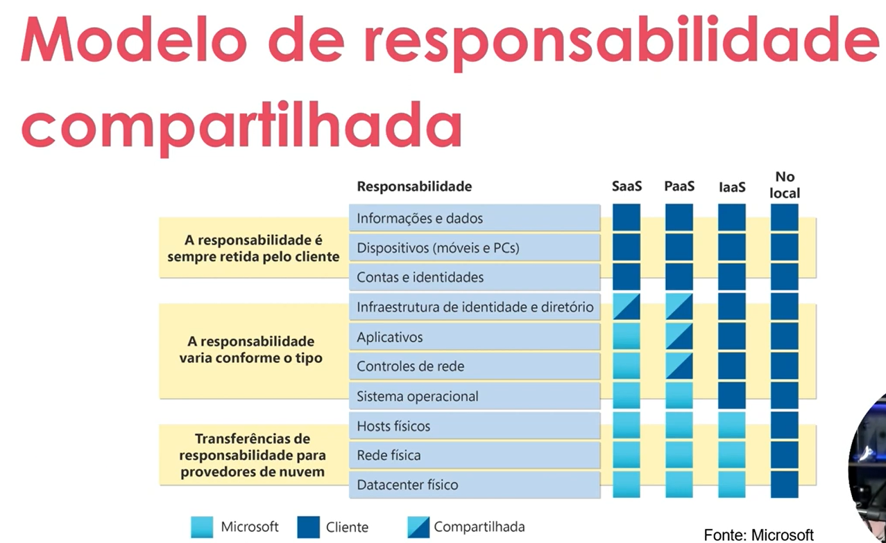

# IaaS (Infrastructure as a Service)

- Encompasses:
  - Servers and storage
  - Firewalls/Network security
  - Physical plant/Datacenter edifications
- More responsability to configure, but more flexibility
- Create a IT infra pay as using servers, VMs, storage, networks and SOs from a cloud provider

# PaaS (Platform as a Service)

- Focus on the application, not on the infrastructure
- Encompasses (Beyond IaaS):
  - Operating systems (SO)
  - Developers tools, business analytics tools and database management
- Provides a creation, testing and deployment envoironment for software apps, without focus on the subjacent infrastructure

# SaaS (Software as a Service)

- Encompasses (Beyond IaaS + PaaS):
  - Software/apps hosted in the cloud
- Users connect and use apps hosted in the cloud. Ex: Microsoft Teams, Office 365, emails, Slack, etc.
- Signature model

# Shared Responsibility Model

