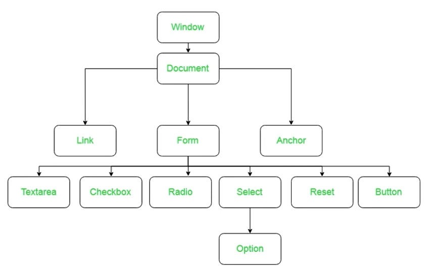

# DOM (Document Object Model)

- It's an interface for HTML and XML documents
- Represents the document as a tree structure, with nodes and elements.
- Visualization: 

## Basic operations

- `getElementsByTagName()`: finds all elements by their tag name
- `getElementsByClassName()`: finds all elements by their class name
- `getElementById()`: finds an element by its ID
- `querySelector()`: finds an element by its CSS selector
